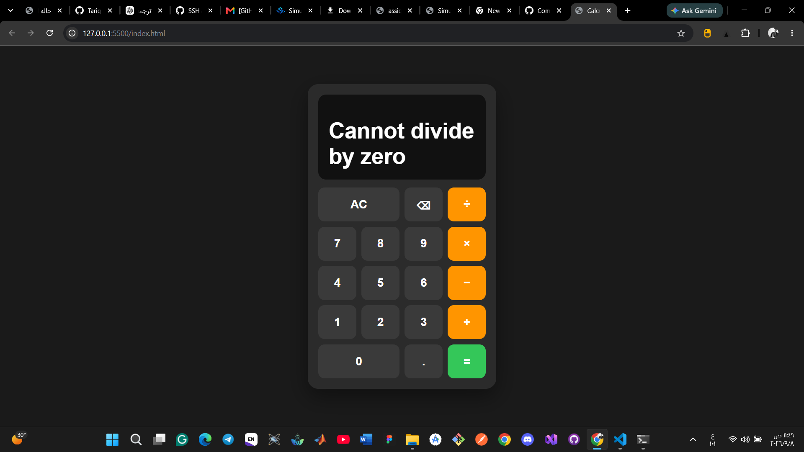

# Calculator

A simple calculator web application built with HTML, CSS, and JavaScript.

## Features

* Addition
* Subtraction
* Multiplication
* Division
* Decimal numbers
* Clear and delete functions
* Input validation
* Division by zero handling
* Repeat calculations without restarting

## Technologies

* HTML5
* CSS3
* JavaScript

## How to Run

1. Clone the repository.
2. Open the project folder.
3. Open `index.html` in a web browser.

## Repository

GitHub: https://github.com/Tariq-Zeyad/calculator-project

## Project Structure

```text
calculator-project/
├── index.html
├── style.css
├── script.js
├── image.png
├── Screenshot 2026-09-08 115004.png
└── README.md
```

## Screenshots

### Calculator



### Calculator Screenshot 2


